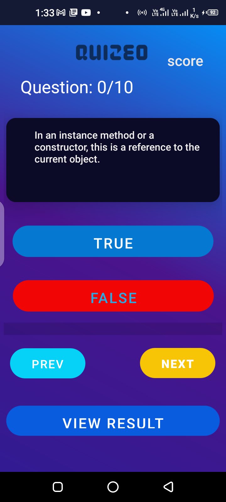
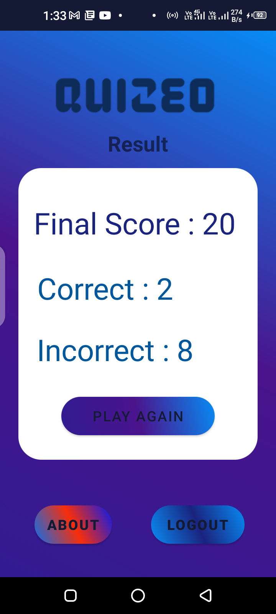

# Quizeo
Quizeo is a Quiz Application for android 

Latest Version is out [here](https://github.com/SmartApps-Ind/Quizeo/releases/tag/v0.1.3)

# Sample Screenshot

  &emsp; 

  &emsp;

&emsp;  

 &emsp; 


```
The app is based on firebase so you have to create an account than you can use 
This will be very helpful for beginners who are learning android development 
keep intracting with SmartApps-Ind for awesome beginner android app
This include a license and you can modify it and do whatever you want with the code just give a star 
```
**Follow TheKnight [Here](https://github.com/W1LDN16H7)**
